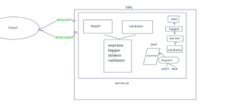

# LAB - 02

## Project: Basic-Express-Server

### Author: Kenya Womack

### Problem Domain

From a business requirements standpoint, we will be building a basic Express server using best practices, including server modularization, use of middleware, and tests.

### Links and Resources

- [GitHub Actions ci/cd](https://github.com/KenyaWomack/basic-express-server/actions)
- [back-end prod server url](https://api-server-lab03.onrender.com/)

### Collaborators

- Kao Saelor
- Hayden Cooper
- Coriana Williams

### Setup

#### `.env` requirements (where applicable)

Using only PORT which can be found on `.env.sample`

#### How to initialize/run your application (where applicable)

Clone repo, `npm i`, then run `nodemon` in the terminal

#### Routes

- GET : `/` - specific route to hit

#### Tests

To run tests, after running `npm i`, run the command `npm test`

#### UML

